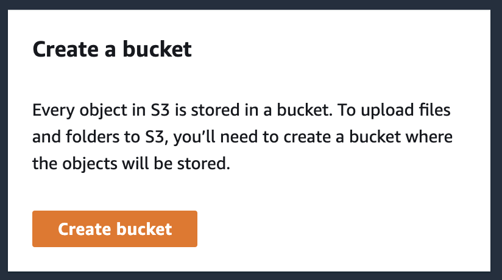
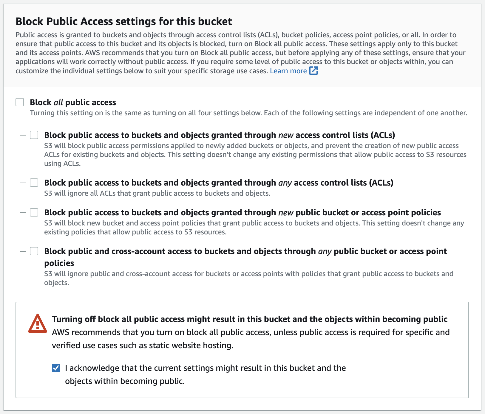
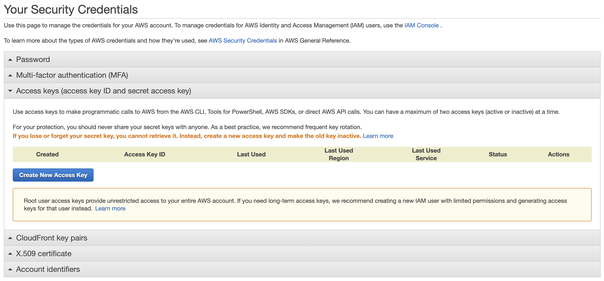

# AWS S3 React Tutorial

In this tutorial we will go over using AWS S3 to upload files from React application with a help of our own Express server.

As a high level definition, S3 is an Object Storage Service, also known as file storage. For us developers the use cases for file storage are obvious: uploading images, videos and other static or user generated media. S3 provides an affordable, secure and scalable solution for these needs.

First off, we need to set up an AWS account. You will need to provide a Credit Card information but S3 comes in a free tier for 12 months with the following limitations:

- 5 GB of Standard Storage
- 20,000 Get Requests
- 2,000 Put Requests

As long as our application doesn't go above these we will be able to stay within the limits of the free tier. Anything above that gets charged according to [standard pricing model](https://aws.amazon.com/s3/pricing).

## What we are building

We'll be building a simple image gallery application that allows a user to upload images to the cloud and then view the uploaded images as a gallery. 

The application consists of a React client and an Express server. We could upload to S3 directly from frontend but since we'll be required to provide our credentials to connect to AWS, for security reasons, we'll set up a server where we can store those securely as environment variables. 

Having our own API will also allow us to do something useful with the uploaded files, for instance, store links for our uploaded files alongside some additional information we might want to provide from the frontend for our gallery.

## Setting up a bucket

First thing we need to do is create a bucket. You can think of an S3 bucket as a folder where you can store your files. There is no limit to how many buckets you have or how many files you can put in a bucket. Just like folders, every bucket needs to have a unique name which can be used only once. 

In AWS interface search for **S3** service. 


This is where you will find all your buckets once you start creating them, but for now let's just create our first bucket by clicking on the button:



In the **General configuration** section, pick a unique name for your bucket as well as the region (fine to keep as is, just remember it for the future).


For **Object Ownership** section, make sure to change to **ACLs enabled**, otherwise, you'll get permissions error trying to upload the files later on.


Since for our use case we want public access to the files (ie: we want to be able to link to them in our app, using them for image sources), let's uncheck the *Block all public access* option:



We can leave the rest of the options as is and just go forward with creating a bucket.

Once the bucket has been created, you will be taken to Dashboard page with a list of all available buckets:


Click on the name of your newly created bucket (in my example, the `test-react-aws-s3`) and then go into the **Permissions** tab.


Scroll to the **Bucket policy** section, click on **Edit** button and paste the following JSON (replacing `BUCKET_NAME` with the name of your bucket, ie: `test-react-aws-s3` in my case):

```
{
    "Version": "2012-10-17",
    "Statement": [
        {
            "Sid": "PublicListGet",
            "Effect": "Allow",
            "Principal": "*",
            "Action": [
                "s3:List*",
                "s3:Get*"
            ],
            "Resource": [
                "arn:aws:s3:::BUCKET_NAME",
                "arn:aws:s3:::BUCKET_NAME/*"
            ]
        }
    ]
}
```

This will allow public access to the folder's content.

Under **Access control list (ACL)** allow the **Read** access to *Everyone (public access)*. This will allow us to link to these files externally.


Next, scroll to the **Cross-origin resource sharing (CORS)** section, click on **Edit** button, and paste the following CORS policy, allowing third-party servers to connect to this bucket:

```
[
    {
        "AllowedHeaders": [
            "*"
        ],
        "AllowedMethods": [
            "PUT",
            "POST",
            "DELETE",
            "GET",
            "HEAD"
        ],
        "AllowedOrigins": [
            "*"
        ],
        "ExposeHeaders": [
            "x-amz-server-side-encryption",
            "x-amz-request-id",
            "x-amz-id-2"
        ],
        "MaxAgeSeconds": 3000
    }
]
```

This policy will allow requests from "*" or any domain, but can be updated accordingly if you want to make it more limited.

## Getting connection credentials

We are all done with the setup now; next we need to get the credentials in order to be able to connect to our bucket programmatically.

We'll need the bucket name and location that we can grab from the dashboard:


We'll also need *Access Key* and *Secret Key* that we can find under profile dropdown in top right corner, under **Security credentials** section:


Under **Access Keys**, click on **Create New Access Key**:



and then **Download Key File** which will download a CSV file to your computer.


Keep in mind that it's confidential information, so we'll make sure to keep it somewhere safe, ie in environment variables.

## Going over server-side code

Open up starter code `s3-server` folder.

First thing we need to do to be able to connect to AWS account is store the credentials we got from previous section in environment variables. Make a copy of `.env.example` file, rename it to `.env` and fill it out with your own credentials, ie: 

```
PORT=5050
AWSAccessKeyId=<ACCESS_KEY>
AWSSecretKey=<SECRET_KEY>
AWSBucketName=<your-bucket-name>
AWSRegion=<us-east-1>
```

Next, take a look at `package.json` file to see the packages we'll be using for the API. The only package related to AWS is the `aws-sdk` package.

Take a couple of minutes to go over the source code starting with `server.js` and refer to comments throughout source code to make sense of the functionality.

All the AWS related functionality will be found in `./routes/s3.js` file.

### AWS Functionality

The general idea here is that we want to avoid uploading our files directly to the bucket from frontend, because that would require us to expose our credentials, which is a bad idea.

So instead we can ask AWS to provide us with a unique upload link for each asset. This link has an expiration time, making it harder to abuse. We can then use this one time link on frontend to do the upload. 

Additional benefit is that we don't actually need to send the file itself to _our_ server to then upload it to AWS, which might also be time and resource consuming, but rather we just send the file name to our own server and then use the generated upload link on frontend to do the actual upload. Secure and fast!

### Gallery Functionality

For simplicity sake our gallery functionality is using JSON files to store gallery items. In real application it would be a much better idea to set up a database to store that data.

The main takeaway here is that after we upload files to S3, we often need to store the URL of the uploaded file somewhere else, to then link it up to related resources. This example simply demonstrates that process and can be adjusted based on application needs.

## Going over client-side code

Open up starter code `s3-client` folder.

Make a copy of `.env.example` file, rename it to `.env` and fill out the URL of your API server, ie:

```
REACT_APP_GALLERY_SERVER_URL=http://localhost:5050
```

Similar to API source code, take some time to go over the source code for the React application to see the flow. The comments will point out main points of implementations. It's a good idea to start with `./src/App.js` component.

All of the image upload functionality will be in `./src/components/ImageUpload` component.

## Additional Resources

- [How to Access Private S3 Buckets Securely](https://javascript.plainenglish.io/how-to-access-private-s3-buckets-securely-87778efd93bd)
- [How to Upload Files to AWS S3 in React](https://javascript.plainenglish.io/how-to-upload-files-to-aws-s3-in-react-591e533d615e)
- [Upload files to Amazon S3 from a React Frontend](https://blog.devgenius.io/upload-files-to-amazon-s3-from-a-react-frontend-fbd8f0b26f5)
- [Amazon S3 Node.js Examples](https://docs.aws.amazon.com/sdk-for-javascript/v2/developer-guide/s3-node-examples.html)